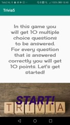
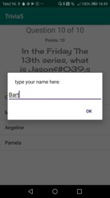

# Trivia5

App waarmee het spelletje Trivia gespeeld kan worden. 
In deze app worden 10 multiple-choice vragen gesteld waar 10 punten kunnen worden verdiend per goed antwoord.
De scores worden weergegeven aan het einde van het spel.

Triviastart verticaal:

Trivia vragen:

Trivia naaminvoer:

Trivia highscores:

